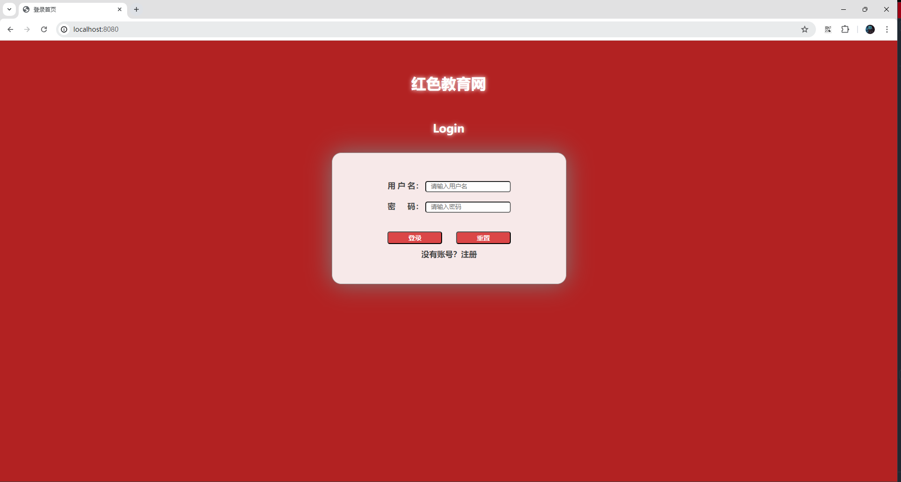
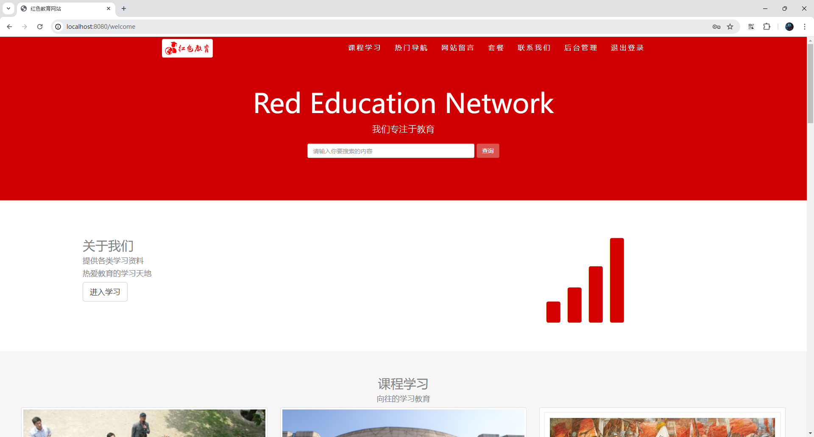
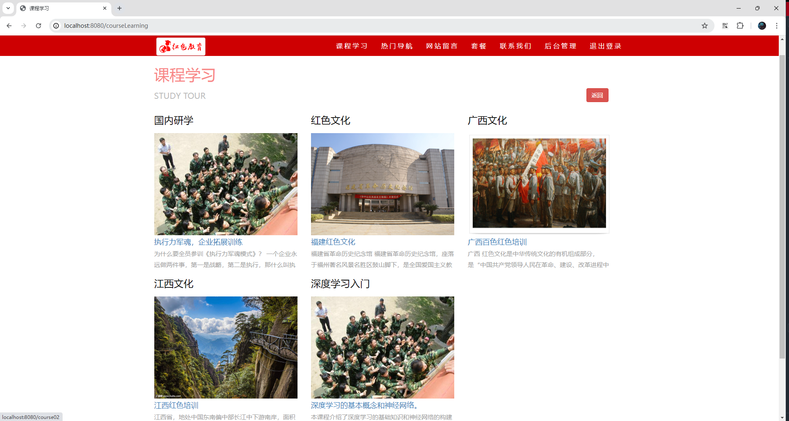
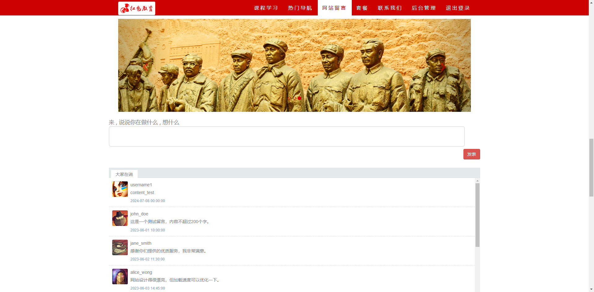
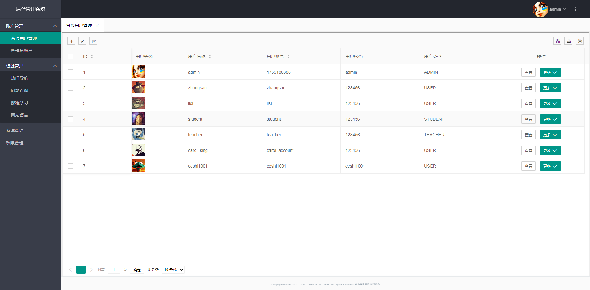

<h1 style="text-align: center">红色教育网站系统</h1>


#### 项目简介
一个基于 Spring Boot 2.7.2 、 MySQL、 Mybatis-Plus 、 LayUI 的红色教育网站

#### 主要特性
- 使用最新技术栈，社区资源丰富
- 关于红色教育主题的为数不多的 Spring Boot 项目
- 高效率开发

####  系统功能

- 用户管理：提供用户的相关配置，用户的增删改查
- 问题查询管理：对前台问题查询模块的维护和管理
- 导航管理：对前台导航的管理
- 课程学习管理：上传课程资料和学习视频，管理资料
- 网站留言管理：对前台页面的留言进行管理和维护


#### 项目结构

```
- redems-boot 主模块
    - db 存放sql和更新sql
    - src/main 程序主文件夹
        - java/com.rems.boot
            - config 提供了过滤器、拦截器和SpringMvc的配置
            - controller 接口层，提供各种接口
            - mapper 数据访问对象层，提供各种mapper接口
            - entity 实体类
            - service 业务层，提供各种逻辑和业务
            - RemsBootApplication 主启动类
        - resources
            - mapper 对应的mapper.xml文件（sql）
            - static 静态文件，如css、images、js等
            - templates 前端的所有页面，配合thymeleaf来渲染页面
            - application.yml 程序的主配置文件包含端口、数据源、mybatis等
        
```

#### 开发环境

1. IDE（推荐 IntelliJ IDEA）
2. JDK 1.8+
3. MySQL 8.0+
4. Maven 3.6+

#### 快速启动

- 克隆项目到本地
- 导入项目到 IDE
- 修改 application.yml 中的数据库连接信息
- 运行 RemsBootApplication 类
- 打开浏览器，输入 http://localhost:8080 访问项目

#### 项目演示

- 登录页面

- 首页

- 课程学习

- 热门导航

- 网站留言

- 后台管理
