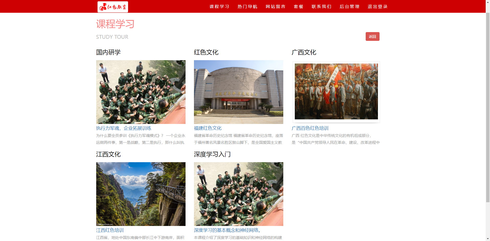

<h1 style="text-align: center">红色教育网站系统</h1>

 <p align="center">
      
      
  
   
   <a target="_blank" href="https://bladex.cn">
   
 </a>
 <a target="_blank" href="https://bladex.cn">
   
 </a>
 </p>  


### 项目简介
&emsp;&emsp;**红色教育平台** —— 基于`Spring Boot 2.7.
2`、`MySQL`、`Mybatis-Plus`和`LayUI`构建的全面教育网站，旨在传承红色文化，弘扬革命精神。本项目融合了现代技术，为用户提供了一个互动性强、信息丰富的在线学习环境。

### 主要特性
- **前沿技术栈**：采用最新的Spring Boot框架，结合MySQL数据库和Mybatis-Plus持久层框架，确保了项目的稳定性和高效性，同时享受丰富的社区资源支持。
- **独特主题定位**：作为市场上少数以红色教育为主题的Spring Boot项目，具有鲜明的特色和强烈的教育意义。
- **快速开发周期**：通过现代化的开发工具和流程，实现快速迭代和高效开发，缩短项目上线时间。

###  系统功能

- **用户管理系统**：
  - 个性化配置：提供用户个人资料设置，满足个性化需求。
  - 全面操作功能：支持用户信息的增删改查，便于管理员进行高效管理。
- **问题查询管理**：
  - 内容维护：实现对前台问题查询模块的内容更新和维护。
  - 智能检索：提供关键词搜索功能，快速定位问题，提高管理效率。
- **导航管理**：
  - 灵活配置：轻松管理前台导航栏，支持自定义排序和快速添加。
  - 用户体验优化：通过合理的导航设计，提升用户浏览体验。
- **课程学习管理**：
  - 资源丰富：支持课程资料和视频的上传，构建丰富的在线学习资源库。
  - 高效管理：提供便捷的课程资料管理界面，轻松进行内容更新和分类。
- **网站留言管理**：
  - 互动维护：对用户留言进行实时监控和管理，维护良好的社区氛围。
  - 反馈响应：快速响应用户留言，提升用户满意度和参与度。


### 项目结构

```
|-- rems-boot
  |-- db -- 数据库脚本
    |-- src/main/java/com/rems/boot
      |-- RemsBootApplication.java          # Spring Boot 启动类
      |-- config                            # 相关配置
      | |-- filters                         # 过滤器
      | |-- handler                         # 处理器
      | |-- interceptors                    # 拦截器  
      |-- controller                        # 控制器
      |-- core                              # 核心模块
      |-- entity                            # 实体类
      |-- enums                             # 枚举类
      |-- mapper                            # Mybatis-Plus 映射文件
      |-- model                             # 业务模型
      | |-- vo                              # 视图对象
      |-- service                           # 业务逻辑层
      | |-- impl                            # 实现类
      |-- utils                             # 工具类
    |-- src/main/resources
      |-- application.yml                   # Spring Boot 配置文件
      |-- mapper                            # Mybatis-Plus 配置文件
      |-- static                            # 静态资源
      | |-- index.html                      # 首页
      | |-- bootstrap                       # boostrap 相关资源
      | |-- css                             # 样式资源
      | |-- images                          # 图片资源
      | |-- jquery                          # jquery 相关资源
      | |-- js                              # js 相关资源
      | |-- layui                           # layui 相关资源
      | |-- md5                             # md5 加密工具类
      |-- templates
        |-- error                           # 错误页面
        |-- rems-back                       # 后台管理页面
        | |-- index.html                    # 后台管理首页页面
        | |-- rems-core                     # 后台管理核心模块页面
        | |-- rems-course-learning-manage   # 课程学习管理页面
        | |-- rems-message-manage           # 网站留言管理页面
        | |-- rems-popular-nav-manage       # 热门导航管理页面
        | |-- rems-question-manage          # 问题查询管理页面
        | |-- rems-user-manage              # 用户管理页面
        |-- rems-front                      # 前台页面  
```

### 开发环境

1. IDE（推荐 IntelliJ IDEA）
2. JDK 1.8+
3. MySQL 8.0+
4. Maven 3.6+

### 快速启动

- 克隆项目到本地
- 导入项目到 IDE
- 修改 application.yml 中的数据库连接信息
- 运行 RemsBootApplication 类
- 打开浏览器，输入 http://localhost:8080 访问项目

### 项目演示

- 登录页面
  
- 首页
  
- 课程学习
  
- 热门导航
  
- 网站留言
  
- 后台管理
  
  